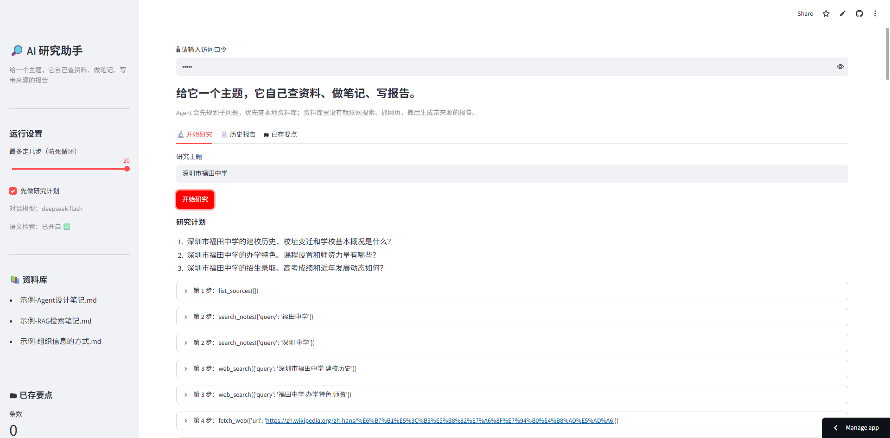
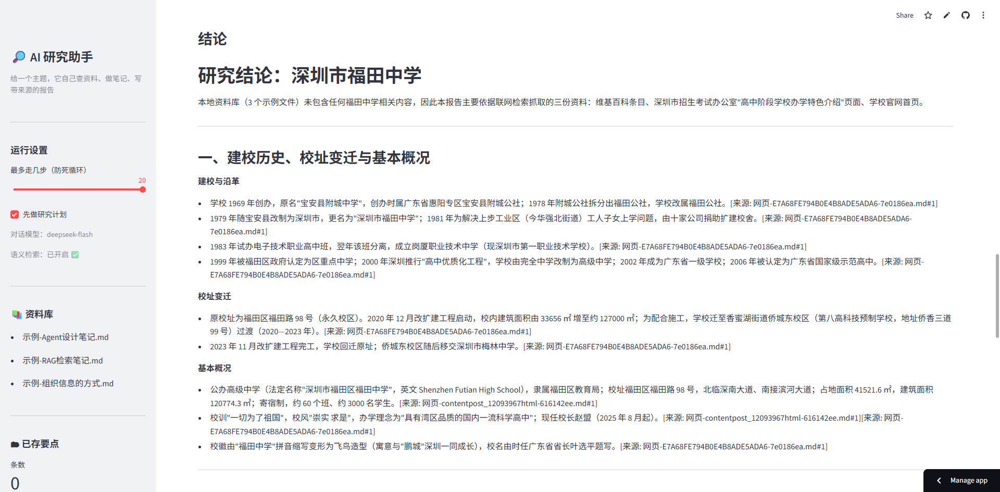
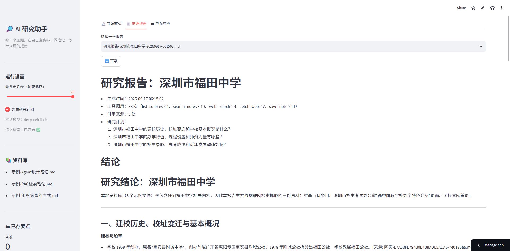
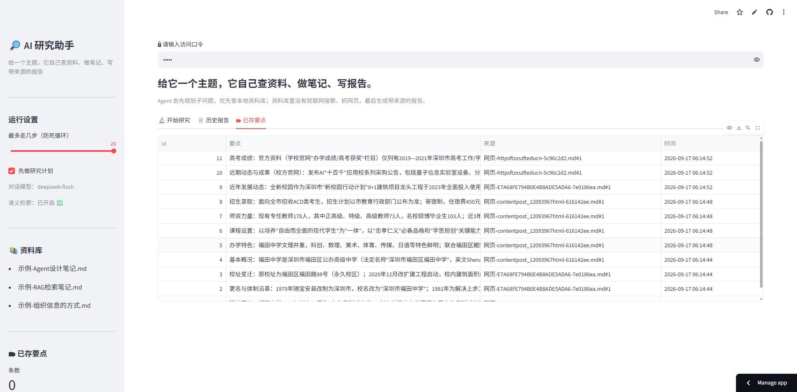

# AI 研究助手（自主 Agent）

[](https://github.com/491196907/research-agent/actions/workflows/tests.yml)
[](LICENSE)

> **给一个研究主题，AI 自己规划、找资料（本地 + 联网）、记笔记，最后写出一份带来源的研究报告。**

**Python 3.10+** · **Streamlit** · **DeepSeek API** · **向量检索（embedding）** · **SQLite** · **33 个单元测试（每次 push 自动跑）**

### 🔗 在线体验（需要口令）

**https://research-agent-yaoyi.streamlit.app/**


>
> - **想要口令**：在 [Issues](../../issues/new) 里留一条，或直接联系我 —— 我把口令发你，就能直接用
> - **想自己部署**：fork 本仓库，按「二、怎么用」配自己的 key（DeepSeek / 硅基流动 / Tavily 都有免费额度）

### 📦 本地跑起来

```bash
git clone git@github.com:491196907/research-agent.git
cd research-agent && py -m pip install -r requirements.txt
py main.py          # 命令行版；界面版用 py -m streamlit run app.py
```

### 📄 看效果

`outputs/` 里有 4 份自动生成的报告样例（含来源清单 + 每一步运行轨迹），`screenshots/` 里有界面截图。

---

## 三十秒看懂它是什么

普通的 AI 问答是"你问一句、它答一句"；这个不一样 —— **你只给一个主题，剩下的它自己决定**：

```
你输入：RAG 的切片策略
   ↓
① 规划     它自己把主题拆成 3 个子问题
   ↓
② 循环     查本地资料库 → 没找到就联网搜 → 抓网页正文 → 存进资料库 → 再检索 ……
            （每一步调用什么工具，都是模型自己决定的）
   ↓
③ 收尾     信息够了就停下来，写出结论
   ↓
④ 交付     outputs/研究报告-xxx.md —— 每个结论都带 [来源: 文件名#片段]
```

### 实机截图

| 输入主题 → 它自己规划并执行每一步 | 自动生成的报告（每条结论都带来源） |
|---|---|
|  |  |
| **历史报告**：工具调用统计 + 一键下载 | **已存要点**：存在 SQLite 里的要点，带来源 |
|  |  |

> 这组截图是真实跑出来的：**33 次工具调用、11 条要点、3 处引用来源**，主题"深圳市福田中学"。

---

## 目录

| 想了解 | 看哪节 |
|--------|--------|
| 它有哪些功能 | [一、功能清单](#一它能做什么功能清单) |
| 怎么装、怎么跑 | [二、怎么用](#二怎么用3-步) |
| 常用命令 | [三、常用命令](#三常用命令) |
| 代码结构 | [四、项目结构](#四项目结构) |
| 原理（Agent 循环） | [五、它是怎么跑的](#五它是怎么跑的原理) |
| 改配置 | [六、配置在哪改](#六配置在哪改) |
| 报错怎么办 | [七、常见问题](#七常见问题) |
| 分享给别人 | [八、分享给别人用](#八分享给别人用三种方式) |
| 开发路线 | [九、开发路线](#九开发路线) |
| 测试覆盖了什么 | [十、测试覆盖了什么](#十测试覆盖了什么) |
| 更新记录 | [十一、CHANGELOG](CHANGELOG.md) |

---

## 一、它能做什么（功能清单）

| 功能 | 说明 |
|------|------|
| **自主研究** | 输入一个主题，Agent 自己跑完"规划 → 检索 → 记录 → 总结"，最多 12 步（防死循环） |
| **自动规划** | 先把主题拆成 3 个子问题，再逐个检索（报告里也能看到计划） |
| **本地资料检索** | 在 `资料库/` 里查资料（.md / .txt）：配了 embedding key 就是**语义检索**，没配自动降级为**字面检索** |
| **要点入库** | 把提炼的结论存进 SQLite（`outputs/research.db`），重启不丢 |
| **生成报告** | 自动写 `outputs/研究报告-<主题>-<时间>.md`：结论 + **引用来源清单** + 研究计划 + 每一步轨迹 |
| **容错** | 网络失败自动重试（指数退避 1s→2s→4s）；工具出错返回"人话"不崩溃；连续 4 次查不到会提前停止 |
| **全程日志** | 每一步写进 `outputs/logs/research-agent.log`（含 DEBUG 细节与完整报错堆栈） |
| **联网搜索**（新） | 本地资料库查不到时，用 `web_search` 自己上网搜，拿到链接后用 `fetch_web` 抓正文存进资料库，再检索、总结 —— **这样就能研究资料库里完全没有的主题（比如"怎么学英语"）** |
| **抓网页**（新） | 给一个网址就能把网页正文抓下来存进 `资料库/`，之后自动可检索；公司网络可能拦，失败会退回本地资料 |
| **网页界面**（新） | Streamlit 界面：输入主题、实时看 Agent 每一步、下载报告、浏览历史报告和已存要点 |

---

## 二、怎么用（3 步）

### 1. 准备环境

```powershell
cd E:\Deepseek工作区\ai学习\git仓库\项目\research-agent
py -m pip install -r requirements.txt          # 只需要一次

setx DEEPSEEK_API_KEY "sk-你的key"              # 必须
setx SILICONFLOW_API_KEY "sk-你的key"           # 可选：不配也能跑，只是检索降级成"字面"
```

> 设完环境变量要**重开终端**才生效。
> 自检：`py -c "from core import config; print('DeepSeek:', bool(config.API_KEY), 'Embedding:', bool(config.EMBED_API_KEY))"`

### 2. 放资料

把你的资料（`.md` / `.txt`）放进 `资料库/`。一个主题一个文件最清楚，文件里用小标题（`##`）分段效果更好。

（现在里面有三份**示例资料**，可以直接删掉换成你自己的。）

### 3.（可选但推荐）配一个联网搜索 key

本地资料库查不到时，Agent 会自己上网搜。**不配 key 也能搜**（走 Bing 网页版），但：

| 方式 | 说明 |
|------|------|
| 不配（默认） | 走 Bing 网页版。你家网络能通就行；**但云服务器常被 Bing 拦**，会出现"搜不到" |
| 配 Tavily（推荐） | 走 JSON API，不受网页反爬影响。注册 `tavily.com` 有免费额度 |

```powershell
# 本地开发：
setx TAVILY_API_KEY "tvly-你的key"

# Streamlit Cloud：Manage app → Settings → Secrets 里加一行
TAVILY_API_KEY = "tvly-你的key"
```

> 配好之后，在界面左侧「🔧 自检」里点一下「测试联网搜索」，能出结果就说明生效了。

### 4. 跑研究

```powershell
cd E:\Deepseek工作区\ai学习\git仓库\项目\research-agent
py main.py
# 然后输入主题，例如：RAG 的切片策略
```

跑完你会看到：

- **屏幕上**：Agent 每一步在干什么 + 最终结论
- **`outputs/` 里**：一份 `研究报告-xxx.md`（带来源）
- **`outputs/logs/` 里**：完整运行日志

---

## 三、常用命令

| 想干什么 | 命令 |
|----------|------|
| 跑一次研究（命令行） | `py main.py` |
| **打开网页界面**（新） | `py -m streamlit run app.py`（浏览器自动打开，Ctrl+C 停止） |
| 跑测试（26 个用例，不花钱） | `py -m pytest tests -q` |
| 只看检索效果 | `py -m core.retriever` |
| 试工具 | `py -m core.tools` |
| 试 embedding 后端 | `py -m core.embedder` |
| 看数据库里存了什么 | `py -c "from core import store; [print(r) for r in store.list_notes(10)]"` |
| 改配置 | 打开 `core/config.py` |

---

## 四、项目结构

```
research-agent/
├── main.py              ← 命令行入口：输入主题 → 跑 Agent → 显示结果
├── app.py               ← 网页界面（Streamlit）
├── core/                ← 核心代码（一个文件一件事）
│   ├── config.py        ← 所有配置：key、地址、模型名、路径、步数、重试
│   ├── llm.py           ← 和模型说话（chat / chat_with_tools / 自动重试）
│   ├── agent.py         ← Agent 循环：规划 → 想 → 做 → 看 → 写报告
│   ├── tool_schema.py   ← 工具的"菜单"（写给模型看的说明书）
│   ├── tools.py         ← 工具的"真身"（查资料 / 记笔记 / 列清单 / 抓网页）
│   ├── retriever.py     ← 检索：切片 + 向量 + 余弦相似度排序
│   ├── embedder.py      ← 把文字变成向量（本地 / API / 假后端，可切换）
│   ├── store.py         ← SQLite：存要点（重启不丢）
│   ├── report.py        ← 写 Markdown 报告（结论 + 来源 + 轨迹）
│   └── log_setup.py     ← 日志配置（控制台 + 文件）
├── tests/test_core.py   ← 33 个测试（检索 / 工具 / 抓网页 / 数据库 / 循环 / 报告 / 回调）
├── screenshots/         ← 界面截图
├── 资料库/              ← 你的资料放这里
├── outputs/             ← 产物：研究报告、数据库、日志
└── requirements.txt
```

---

## 五、它是怎么跑的（原理）

```
你输入主题
   ↓
① 规划：让模型把主题拆成 3 个子问题
   ↓
② 循环（最多 12 步）：
     把 messages + 工具菜单 交给模型
        ↓
     模型说"我要调用 search_notes(query=切片)"      ← 它自己决定
        ↓
     程序真的去检索（向量检索 → 资料库）
        ↓
     把结果作为 role="tool" 的消息塞回 messages
        ↓
     再问一次模型 ……
   ↓
③ 模型不再调用工具 = 它给出结论 → 循环结束
   ↓
④ 写报告：结论 + 引用来源 + 运行轨迹 → outputs/
```

**三条保险**：最大步数（12）、无进展检测（连续 4 次查不到就停）、网络重试（3 次，指数退避）。

---

## 六、配置在哪改

全部在 `core/config.py`：

| 配置 | 默认 | 说明 |
|------|------|------|
| `MODEL` | `deepseek-flash` | 换模型只改这里 |
| `MAX_STEPS` | `12` | Agent 最多走几步 |
| `RETRY_TIMES` / `RETRY_BASE_DELAY` | `3` / `1.0` | 网络重试次数与退避基准 |
| `EMBED_MODEL` | `BAAI/bge-m3` | 换 embedding 服务（文件里注释了阿里云百炼的写法） |
| `SEARCH_API_KEY` | 无（读 `TAVILY_API_KEY`） | 不配也能搜（走 Bing 网页版）；配上更稳 |
| `DEBUG` | `True` | 改成 `False`：控制台只显示 INFO 以上（日志文件仍记 DEBUG） |

---

## 七、常见问题

| 现象 | 原因 / 解决 |
|------|------------|
| `没读到 DEEPSEEK_API_KEY` | 没设环境变量，或设完没重开终端 |
| 检索结果不太准 | 没配 `SILICONFLOW_API_KEY` → 降级成字面检索；配上即为语义检索 |
| `API 出错 400 ... model names` | 模型名过时 → 改 `config.py` 的 `MODEL` |
| Agent 走满 12 步 | 资料太少或主题太泛 → 多放资料，或把主题写具体 |
| 想让它安静点 | 把 `config.py` 里 `DEBUG` 改成 `False` |
| `API 出错 400 ... must be followed by tool messages` | 消息序列不合法（旧版本 bug，已修复）：现在发请求前会自动体检并修好 |
| 同一个问题两次结果不一样 | 模型本身有随机性 + 每轮检索词不同。可把 `config.py` 的 `TEMPERATURE` 调得更低（默认 0.3） |
| 抓网页/搜索总是失败 | 公司网络拦截外部网站是常见情况 —— 不是 bug，Agent 会自动回去用本地资料；想联网可以用手机热点 |
| 想研究资料库里没有的主题 | 直接问就行（例如"怎么学英语"），Agent 会 `web_search` → `fetch_web` → 总结；但**联网结果不保证权威**，重要结论请自己核对 |
| `streamlit` 找不到 | `py -m pip install streamlit`（你的环境里已经装过） |

---

## 八、分享给别人用（三种方式）

| 方式 | 怎么做 | 适合 |
|------|--------|------|
| **① 发 GitHub 地址**（最省事） | 直接发 `https://github.com/491196907/research-agent`，别人自己 clone 跑 | 会 Python 的朋友 |
| **② 给 Streamlit 应用加白名单**（推荐） | App → **Manage app → Settings → Sharing**，填朋友的邮箱；朋友用那个邮箱登录就能用 | 不太懂技术、想直接用的朋友 |
| **③ 给应用加个口令**（配了就能用） | 在 Secrets 里加 `ACCESS_PASSWORD = "你们约定的口令"`，把口令告诉朋友 | 想分享给一群人，但不想完全公开 |

> ⚠️ **千万别把应用设成完全公开，也别把口令写在 README 里** —— 仓库是公开的，写在那儿等于把 API key 交给全世界。
> 正确做法：给谁用就单独发给谁，或者在 **Sharing** 里加对方邮箱。

> 💡 想让很多人用又不花钱？让他们 **fork 一份自己部署**（各自配自己的 key）。

---

## 九、开发路线

这个项目是一步步加上去的，每一步都能单独跑通、单独验证：

| 步骤 | 做了什么 | 对应文件 |
|------|----------|----------|
| 1 | 打通模型调用（含钥匙校验、超时、错误处理） | `llm.py` |
| 2 | 工具调用：function calling + 工具设计与分发 | `tool_schema.py` / `tools.py` |
| 3 | 本地检索：切片 + 词频向量 + 余弦相似度 | `retriever.py` |
| 4 | 语义检索：接入 embedding，本地/API 双后端可切换 | `embedder.py` |
| 5 | 数据持久化：要点存进 SQLite | `store.py` |
| 6 | **Agent 循环**：让模型自己决定下一步 | `agent.py` |
| 7 | 可观测与容错：日志、网络重试、失败换策略、无进展检测 | `log_setup.py` / `agent.py` |
| 8 | 测试：33 个单元测试，全部不花钱、不联网 | `tests/test_core.py` |
| 9 | 报告生成：结论 + 来源清单 + 运行轨迹 | `report.py` |
| 10 | 联网能力 + 网页界面 | `web_search` / `fetch_web` / `app.py` |

---

## 十、测试覆盖了什么

**33 个单元测试，全部不花钱、不联网**（网络和 API 都用 `monkeypatch` 桩掉了），所以 CI 里不需要配任何密钥。

```bash
py -m pytest tests -q        # 本地跑，约 1.5 秒
```

### 检索与向量（10 个）· `retriever.py` / `embedder.py`

| 测什么 | 为什么重要 |
|--------|------------|
| 三种 embedding 后端**接口一致**（本地 / API / 假后端） | 保证"换个后端不用改调用方"这个设计真的成立 |
| 本地后端：向量维度 = 词表大小、同样输入同样输出 | 向量错位是最难查的 bug |
| 工厂：没配 key 时自动回退本地后端 | 保证"没 key 也能跑" |
| 余弦相似度三个边界：方向相同 = 1、垂直 = 0、**零向量不除零** | 查询词全不在词表里时不能崩 |
| 检索：结果带来源、按分数倒序、无结果返回空列表 | 排序和来源是报告可信的基础 |

### 工具层（4 个）· `tools.py`

| 测什么 | 为什么重要 |
|--------|------------|
| 工具名不存在 → 返回"人话"而不是抛异常 | 模型点错菜时不能把 Agent 搞崩 |
| 参数缺失 → 不崩、返回"人话" | 参数是模型填的，填错是常态 |
| 空 query / 空内容 → 被参数校验拦住 | 拦在最外层，不写脏数据 |

### 抓网页（4 个）· `fetch_web`

| 测什么 | 为什么重要 |
|--------|------------|
| 非 http(s) 开头被拒绝 | 安全边界 |
| 网络错误 → 返回"人话"并提示继续用本地资料 | 失败要能降级 |
| 抓成功 → 写进资料库，且 script 标签里的内容被清掉 | 只留正文，不带脚本 |
| 正文太短 → 判定失败 | JS 渲染的页面抓不到正文，要能识别 |

### 联网搜索（5 个）· `web_search`

| 测什么 | 为什么重要 |
|--------|------------|
| 正常解析搜索结果页（标题 / 链接 / 摘要） | 核心功能 |
| 网络失败 → 返回"人话"并提示"没有外部来源必须注明" | 防幻觉，不能瞎编 |
| 失败时**说明试过哪些引擎**、各自什么原因 | 云服务器上排错全靠它 |
| 引擎改版导致类名抠不到 → **通用兜底解析**仍能抠出链接 | 反脆弱 |

### 数据库（2 个）· `store.py`

| 测什么 | 为什么重要 |
|--------|------------|
| 存一条要点：条数 +1，能读回来 | 基本读写 |
| **数据真的持久化**（关掉再打开还在） | 这是选 SQLite 而不是内存缓存的理由 |

### Agent 循环（7 个）· `agent.py`

| 测什么 | 为什么重要 |
|--------|------------|
| 模型直接回答 → 循环结束（不执行任何工具） | 正常出口 |
| 模型点工具 → 执行并回灌 `role=tool` 消息 | 循环的核心动作 |
| **消息序列体检**：把夹在 `tool_calls` 和它的回复中间的无关消息挪走 | API 400 的根治（`assistant(tool_calls)` 后必须紧跟全部 tool 回复） |
| 连续失败 → **先提示模型换策略**（联网 / 换词） | 不要一失败就放弃 |
| 提醒后仍失败 → **强制收尾给结论**，而不是丢一句"提前停止" | 用户至少要拿到结论或"缺什么" |
| 步数用完 → 强制停止并说明 | 防死循环 |
| `on_step` 回调依次收到 计划 → 工具 → 结束 | 网页界面的实时进度靠它 |

### 报告（1 个）· `report.py`

| 测什么 | 为什么重要 |
|--------|------------|
| 报告里同时包含**结论**和**来源** | "带来源"是这个项目的核心承诺 |

> 每次 `push` 都会在 GitHub 上自动跑一遍这 33 个测试（见页面顶部的 tests 徽章）。

## 十一、更新记录

见 [`CHANGELOG.md`](CHANGELOG.md)。
